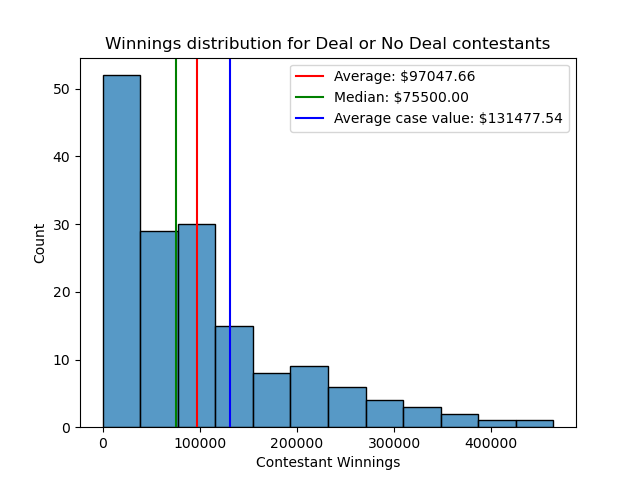
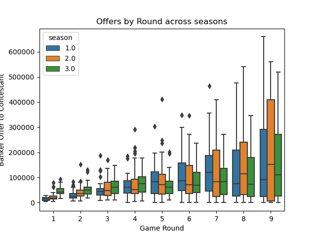
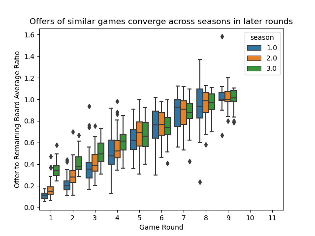
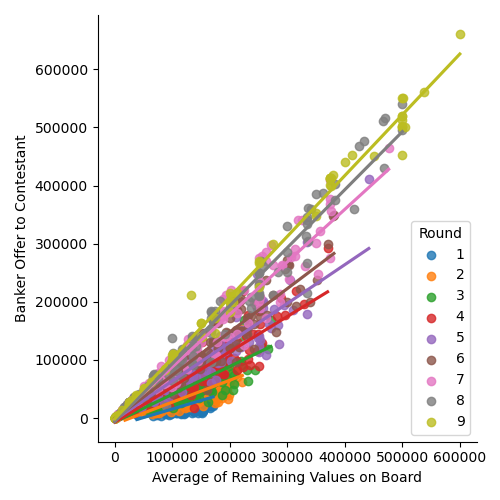
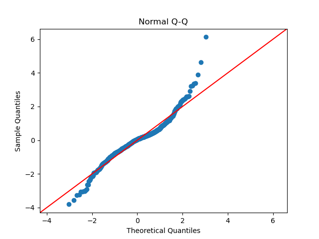
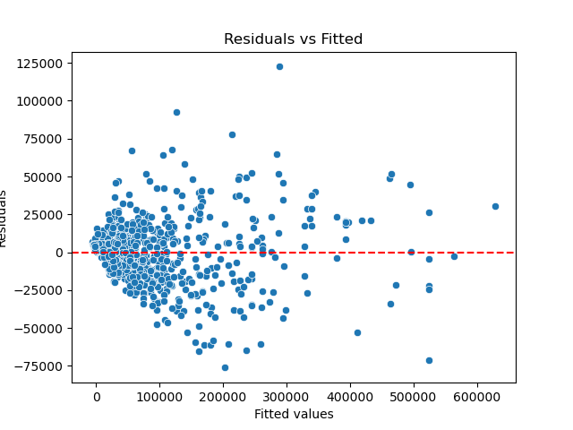
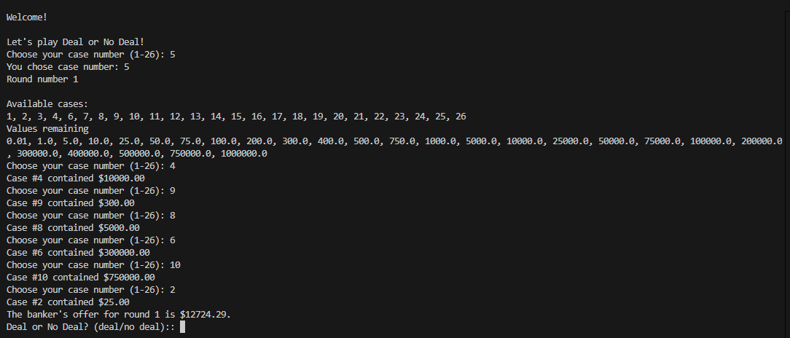

# Deal or No Deal Analysis
This repository contains my code and data used to analyze game data from the American version of the TV show [Deal or No Deal](https://en.wikipedia.org/wiki/Deal_or_No_Deal_(American_game_show)) that premiered on NBC in 2005. I also build a simple game simulator using a model created from the analysis. The project was motivated by my passion for the game and curiousity in investigating patterns that I saw watching the game show.

## Data Collection
Unfortunately, there wasn't a publicly available database from the show that collects data at the game-round-round turn level, and transcripts of the show did not have great audio quality to scrape and structure into formatted data. Therefore, I watched and recorded data on multiple games from seasons 1 through 3 (as of 4/30/2024) in order to guarantee data quality for the analysis. I also scraped episode metadata from IMDB to supplement my collection process; [this notebook](./data/webscraping_and_metadata.ipynb) generates the [data](./data/dond_episode_metadata.csv).

The [Wikipedia](https://en.wikipedia.org/wiki/Deal_or_No_Deal_(American_game_show)) page linked provides in-depth instructions on how the game is played, so I will comment on the rules I followed to collect the data.

1) The [games data](./data/games.csv) is collected at the game-round-round turn level in order to uniquely identify each decision made by the contestant during the game as well as interactions between them and the banker.
2) There are indicator columns for: 1) if the game ended (player made decision), 2) when the decision was made, and 3) the value of the contestant's original case selection. These are 1 if true and null otherwise. Note that 1) a single game could have multiple indicators with a value of 1, i.e. if the contestant takes a deal instead of playing to the end of the game, versus 2) and 3) only have a single row per game where they can take on a value of 1.
3) In the case that players do take a deal, depending on the state of the game (i.e. values left on the board) the host may continue to allow them to select cases. These can be found in the data as rows in the offer column that are not null when the game ended column indicator is 1. NOTE: in the case that the game ended AND the player had unopened cases AND the offer column is null in the data, do not assume that the contestant opened the cases in the order they appear in the data. That is, the game will usually reveal the values in each case at the end of the game, and I entered these based on the ascending order of the case NUMBERS (not values) for completeness. If you do decide to look at the data, please keep in mind that these are likely invalid rows.
4) There is exactly one row per game where the *winnings* column is not null, and it corresponds with the row where the *decision_made* indicator is 1.
5) There are techincally only 9 rounds in which the player can receive an offer from the banker, as you will see in the data. In the case that the player refuses every offer, they have the choice of choosing between their original selection and the one remaining case. To account for this in the data, I have encoded round 10 as the player staying with their own case, and round 11 as the player switching cases. In every game the rows associated with these rounds will have null values for offers. In all the games I watched, no one decided to switch to the last remaining case.
6) For simplicity in later analyses, I only collected data on games that have the 'standard' case values, which you can find [here](./data/case_values.csv). I did not collect data on any special occassions where the board was different than usual or the case values could not be easily mapped back to their standard case value equivalents.

With these rules I attempt to make a well-defined dataset that permit me more exploration and analysis of the data. I also collect demographic data on the [contestants](./data/contestants.csv) for completeness, although I do not explore the data any further with these variables.

## Exploration of the data

While the rules of the data collection are well-defined, additional processing is required in order to manipulate it into a shape suitable for my analysis. I use this [notebook](./data/data_processing.ipynb) to generate the [processed data](./data/dond_processed_data.csv) that is used for both data exploration and modeling. The [exploration notebook](./modeling/exploration.ipynb) goes into detail on the results of my EDA of the data and rationale for model selection, but I include some interesting visualizations based on my exploratory data analysis.

### Winnings

### Offers

## Modeling

Based on the results of my exploration, I build multiple models in the [modeling notebook](./modeling/modeling.ipynb) and evaluate their performance based on out of sample data. The notebook goes more in-depth about model selection, although I ultimately decide to choose a linear model based on the exploration from the previous section as my preferred model of choice due to its interpretability and relatively strong performance compared to other machine learning models. The [latex](./modeling/lm_results.tex) can be found here, and I also include goodness of fit visuals.

## Game simulator

Finally, I finish the project by creating a simulator of the Deal or No Deal game that can be run in the terminal using the files within the [game](./game) directory. I include a screenshot below of a player UI for the game. As described in the [modeling notebook](./modeling/modeling.ipynb), I end up creating a model that randomly samples the game data rather than using the linear model due to the quirkiness of the predictions generated by the model in some edge cases (i.e. negative offers). Feel free to try it out on your own!

